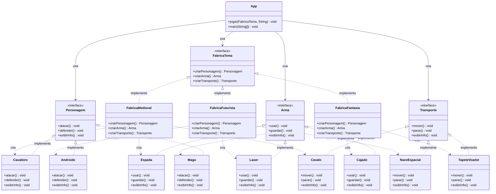

# 🎮 Aula VII – 2: Abstract Factory Pattern (3 Temas + Transporte + Seleção Dinâmica)

> Extensão do padrão **Abstract Factory** com um terceiro tema (Fantasia), família de produto `Transporte` e seleção dinâmica de tema via console sem uso de `if/else`.

---

## 📋 Descrição

Evolução do projeto anterior: agora cada fábrica produz **três tipos de produto** (Personagem, Arma e Transporte), há um terceiro tema completo (**Fantasia**), e a escolha do tema é feita dinamicamente via `HashMap`, eliminando cadeias de `if/else`.

### Temas disponíveis

| Tema      | Personagem | Arma     | Transporte      |
|-----------|------------|----------|-----------------|
| Medieval  | Cavaleiro  | Espada   | Cavalo          |
| Futurista | Androide   | Laser    | Nave Espacial   |
| Fantasia  | Mago       | Cajado   | Tapete Voador   |

---

## 🗂️ Estrutura do Projeto

```
aula VII 2/
└── src/
    ├── App.java                        ← Cliente com seleção via HashMap
    ├── arma/
    │   ├── Arma.java                   ← Interface produto
    │   ├── Espada.java                 ← Produto concreto (Medieval)
    │   ├── Laser.java                  ← Produto concreto (Futurista)
    │   └── Cajado.java                 ← Produto concreto (Fantasia)
    ├── fabrica/
    │   ├── FabricaTema.java            ← Interface Abstract Factory
    │   ├── FabricaMedieval.java        ← Fábrica concreta
    │   ├── FabricaFuturista.java       ← Fábrica concreta
    │   └── FabricaFantasia.java        ← Fábrica concreta (nova)
    ├── personagem/
    │   ├── Personagem.java             ← Interface produto
    │   ├── Cavaleiro.java              ← Produto concreto (Medieval)
    │   ├── Androide.java               ← Produto concreto (Futurista)
    │   └── Mago.java                   ← Produto concreto (Fantasia)
    └── transporte/
        ├── Transporte.java             ← Interface produto (novo)
        ├── Cavalo.java                 ← Produto concreto (Medieval)
        ├── NaveEspacial.java           ← Produto concreto (Futurista)
        └── TapeteVoador.java           ← Produto concreto (Fantasia)
```

---

## 🧩 Diagrama UML



---

## ▶️ Como Executar

**Pré-requisitos:** Java 11+

```bash
# Compilar (a partir da raiz do projeto)
javac -d bin src/arma/*.java src/personagem/*.java src/transporte/*.java src/fabrica/*.java src/App.java

# Executar
java -cp bin App
```

### Exemplo de Execução

```
Temas disponíveis: [medieval, futurista, fantasia]
Escolha um tema: fantasia

=== Tema Fantasia ===
Personagem: Mago | Tema: Fantasia
Arma: Cajado | Tipo: Magia
Transporte: Tapete Voador | Tipo: Mágico

Mago ataca conjurando feitiços com seu Cajado!
Cajado lança uma rajada mágica devastadora!
Mago guarda o Cajado.
Tapete Voador eleva-se suavemente pelos céus!
Tapete Voador pousa delicadamente.
```

---

## 🧠 Conceitos Aplicados

- **Abstract Factory** — `FabricaTema` define uma família completa de 3 produtos.
- **OCP (Open/Closed Principle)** — O tema Fantasia foi adicionado sem alterar as classes existentes.
- **Seleção sem if/else** — O `HashMap<String, FabricaTema>` substitui cadeias condicionais por lookup direto em O(1).
- **Programação por interface** — `App` nunca referencia classes concretas.
- **Família compatível de produtos** — Todos os objetos criados por uma mesma fábrica são garantidamente do mesmo tema.

---

## 🔄 Diferenças em relação ao Projeto 1

| Aspecto               | Aula VII 1          | Aula VII 2                     |
|-----------------------|---------------------|--------------------------------|
| Temas                 | 2 (Medieval, Futurista) | 3 (+ Fantasia)             |
| Famílias de produto   | 2 (Personagem, Arma) | 3 (+ Transporte)              |
| Seleção de tema       | Hardcoded no `main` | Dinâmica via `HashMap` + Scanner |
| Total de classes      | 9                   | 16                             |

---

## 👨‍💻 Tecnologias


